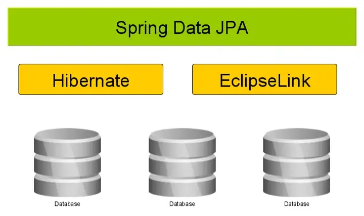

* JPA(Java Persistence API) 자바 어플리케이션에서 관계형 데이터베이스를 사용하는 방식을 정의한 인터페이스
* JPA는 인터페이스만 있는 명세서이며, 기능이 없음
* Hibernate는 JPA를 구현한 구현체
* JPA구현체는 Hibernate있는게 아님
* 구현체는 Hibernate 외 DataNucleus, EclipseLink등 있음
* Spring Data 모듈중 하나로 Hibernate같은 JPA Provider를 사용하여 JPA 더 쉽게 적용하기위해 이미 추상화된 JPA를 한단계 더 추상화 시킨것

# Reference
---
1. https://suhwan.dev/2019/02/24/jpa-vs-hibernate-vs-spring-data-jpa/
1. https://programmingsharing.com/an-overview-of-spring-data-jpa-f7503f06add9
1. https://www.javaguides.net/p/spring-data-jpa-tutorial.html
1. https://stackoverflow.com/questions/23862994/whats-the-difference-between-hibernate-and-spring-data-jpa/23863416#23863416

