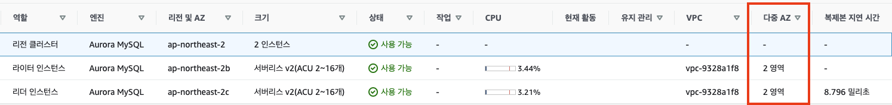

# 개념
* AWS Aurora를 생성 시 Multi-AZ를 활성화하면 자동으로 각기 다른 AZ에 기본 인스턴스 하나, Aurora복제본 하나가 생성됨
* writer인스턴스(기본DB인스턴스, 읽기 및 쓰기 작업 지원)는 읽기 및 쓰기 작업을 지원하고 클러스터 볼륨의 모든 데이터 수정을 수행
* reader인스턴스(Aurora복제본, 읽기 작업만 지원)는 기본 DB인스턴스의 동일한 스토리지 볼륨에 연결되며 읽기 작업만 지원
* Aurora 복제본을 별도의 가용 영역에 배치하여 고가용성을 유지
* Aurora는 기본 DB인스턴스를 사용할 수 없는 경우 자동으로 Aurora복제본으로 장애 조치

# Multi-AZ를 활성화

* AWS Aurora생성 시 Multi-AZ를 활성화하면 위 같이 생성됨

# Reference
1. https://support.bespinglobal.com/ko/support/solutions/articles/73000544828--aws-amazon-aurora-db-클러스터

