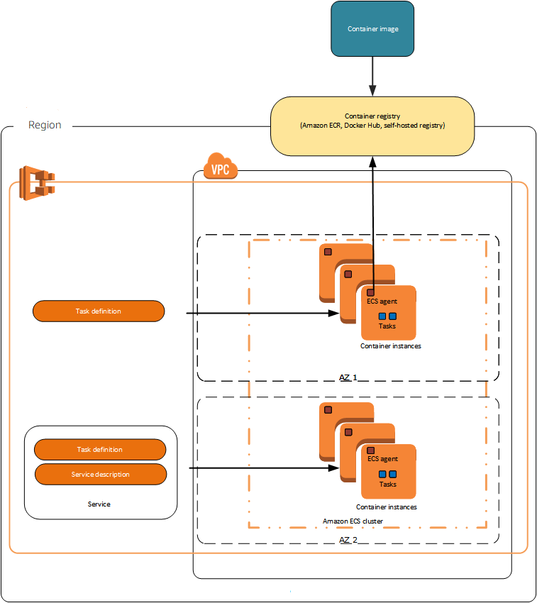
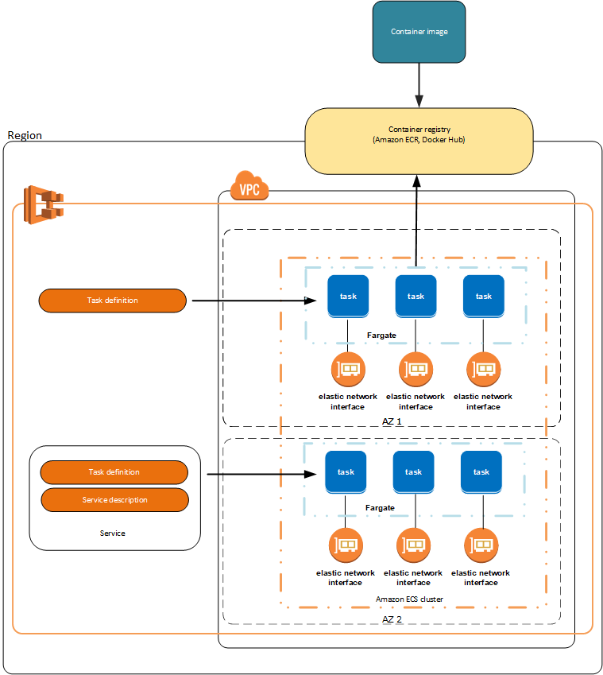
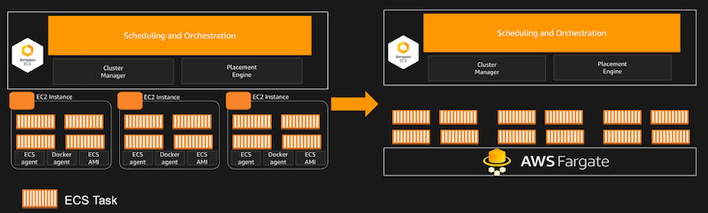

# ECS란
* AWS에서 지원하는 AWS전용 컨테이너 오케이스트레이션
* 따라서 AWS서비스와 통합이 간편

# ECS의  EC2, Fargate, External
* ECS를 구성할때 시작유형을 선택해야된다.
* 예를들면 ECS는 하나의 박스의 역할이고 박스(ECS)에 담긴 내용물(타입)을 관리한다.
* ECS에 담긴 내용물(타입)의 종류는 사용자가 선택가능
* 내용물(타입)의 종류는 EC2, Fargate, External(외부 시작 유형)이 있다.
* 선택된 내용물에 (docker)컨테이너를 띄운다.
* 즉 컨테이너를 띄울 환경(EC2, Fargate, External)를 선택하고 ECS는 이런 환경들을 관리, 운영한다.

# EC2 타입
* EC2 시작 유형으로 Amazon ECS 클러스터를 등록하고 직접 관리하는 Amazon EC2 인스턴스에서 컨테이너화된 애플리케이션을 실행할 수 있음
* 쉽게말해 ECS가 관리하는 내용물이 EC2타입이며, EC2에서 컨테이너가 실행된다.(EC2에서 docker를 띄우는 느낌)
* 용량공급자를 통해 EC2 Auto-ScalingGroup을 연결
* ECS에서 제공하는 관리형 지표 CapacityProviderReservation에 따라 EC2 용량을 추가 또는 제거 가능
* 컨테이너의 숫자가 증가 또는 축소에 따라 EC2도 함께 증가 또는 축소가 된다
* 비용은 EC2요금만 과금

# Fargate 타입
* Fargate타입은 프로비저닝 없이 컨테이너화된 애플리케이션을 실행하고 기본 인프라를 관리할 때 사용할 수 있음
* 즉 서버리스 성격을 가진다.
* 직접 관리 할 필요가 없으며 서버가 어디서 운영되는지 신경쓰지 않아도 된다.
* EC2보다 상대적으로 요금이 비싸다

# External 타입
* AWS인프라가 아닌 곳에 위치한 서버를 ECS에서 관리할 수 있는 타입이다.
* 즉 AWS와 물리적으로 분리된 외부에서 관리는 AWS콘솔에서 할 수 있는 타입
* 다른 데이터센터와 함께 AWS를 운영해야되는 하이브리드 환경에서 적합할 수 있다.

# EC2타입 vs Fargate타입

* 그림에서 왼쪽은 EC2기반 오른쪽은 Fargate기반 ECS
* EC2로 관리되는 ECS는 각 인스턴스(EC2)에 ECS에이전트와 Docker agent를 설치하고 모든 인스턴스를 ECS가 통합하여 관리
* EC2를 관리해야할 부분이 어느정도 생김
* 반면에 fargate는 서버리스로 관리부분이 없음, AWS가 알아서 관리
* ECS의 EC2를 섬세하게 관리를 원한다면 EC2타입으로 관리의 신경을 쓰고싶지 않다면 fargate타입으로 선택

# Reference
1. https://docs.aws.amazon.com/ko_kr/AmazonECS/latest/developerguide/launch_types.html
1. https://tech.cloud.nongshim.co.kr/2021/08/30/소개-amazon-ecs란/
1. https://1mini2.tistory.com/123
1. https://trend21c.tistory.com/2209
