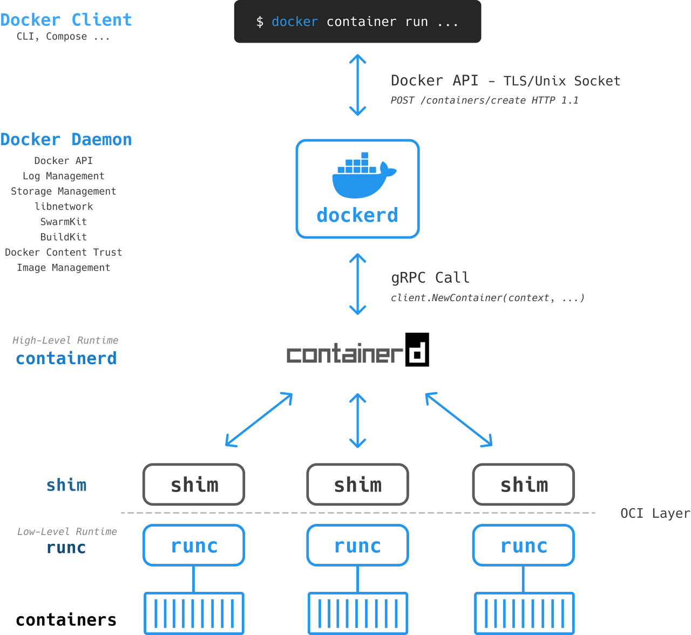

* 위 이미지는 도커 전체 구조를 나타냄
* 위 이미지에서 도커엔진, 데몬 등 도커에서 사용되는 용어와 구조를 전체적으로 파악

# Docker Engine
* 도커는 크게 Docker Client와 Docker Daemon으로 구분됨
* Docker Client는 개발자(사용자)로 docker명령어를 입력 받아 docker daemon에게 전달
* docker daemon은 컨테이너를 빌드, 실행, 배포하는 등의 무거운 작업 수행
* 크게 Docker Client와 Docker Daemon와 몇가지를 포함해서 도커 엔진이라 하며, 일반적으로 개발자들이 Docker라고 할때, Docker Engine을 의미
* 즉, Docker Engine은 컨테이너를 구축하고 실행하는 기본 핵심 소프트웨어
* 자동차 엔진과 도커 엔진은 비유를 하자면, 둘 다 모듈식이고 많은 전용 부품들에 의해 연결되어 제작됩니다.
Car Engine — intake manifolds, throttle body, cylinders, spark plugs, exhaust manifolds etc.Docker Engine — APIs, execution driver, runtimes, shims etc.

# Docker Client
* 사용자(개발자)가 Docker CLI를 통해 명령어 입력
(ex : docker container run --name ctr1 -it alpine:latest sh)
* Docker CLI에 입력하면 Docker client는 적절한 API Payload로 변환해서
Docker Daemon(이하 dockerd)에게 REST API로 POST 요청
(ex :  POST /containers/create HTTP/1.1)
* Docker Client에 Docker Compose도 포함됨

# Docker Daemon(dockerd)
* Docker Client에서 요청한 API는 Unix Socket을 통해 dockerd에게 전달
* Linux에서 socket은 /var/run/docker.sock, Windows는 \pipe\docker_engine
* 새 컨테이너를 시작할 때, dockerd는 로컬 이미지가 있는지 확인하고
없다면 registry repository에서 해당하는 이름의 이미지를 가져옴
* 또한 logging drivers와 volume이나 volume drivers를 설정하는 등 컨테이너에 필요한 대부분의 설정을 지정
* dockerd가 '새로운 container를 생성하라'는 명령을 수신하면, dockerd는 CRUD 스타일 API를 통해 gRPC로 containerd와 통신 (ex : client.NewContainer(context, ...))
* dockerd의 역할로는 이미지 관리, 이미지 빌드, REST API, 인증, 보안, 코어 네트워킹, 오케스트레이션 등이 있음

# Containerd
* containerd는 실제로 containers를 생성하지 못하고, runc를 통해 생성
* Docker 이미지를 가져와서 컨테이너 구성을 적용하여 runc가 실행할 수 있는 OCI 번들로 변환
* containerd는 Container의 생명주기를 관리
* containerd는 High-Level Runtime
* High-Level Runtime은 보통 이미지 관리, gRPC/Web API와 같이 컨테이너를 관리하는 것 이상의 높은 수준의 기능을 지원하는 런타임을 의미

# runc
* runc(내부의 libcontainer 사용)는 OS 커널에 접속해서
컨테이너를 만드는 데 필요한 모든 구성 요소(네임스페이스, cgroup 등)를 하나로 묶고 runc는 새로운 container를 생성
* Docker에서 runc는 목적은 단 하나인데요, 바로 Container 생성

# shim
* 그 다음 컨테이너를 시작하기 위해 docker-containerd-shim과 같은 shim을 실행
* 컨테이너 프로세스는 runc의 하위 프로세스로 시작되는데, 컨테이너 프로세스가 실행하자마자 runc가 종료exite됨
* docker-containerd-shim이 새로운 상위 프로세스가 되어 컨테이너의 생명주기를 관리

# Reference
1. https://junstar92.tistory.com/169
1. https://gngsn.tistory.com/128
1. https://www.itworld.co.kr/news/203644

