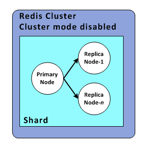

# 개념

* redis node의 집합
* Primary Node 1개 필수와 Replica Node로 구성
* Primary Node는 데이터 갱신과 참조를 수행하고 Replica Node는 프라이머리 노드에 수행한 업데이트 내용이 복제되어 동일한 상태가 유지
* 데이터 갱신 시에는 복제 노드에 복사되는 시간이 걸리지만 데이터 참조 시(읽기)에는 노드 숫자만큼 성증이 향상
* Primary Node에 장애가 발생했을 때도 복제 노드를 계속 참조할 수 있어 내결함성이 향상(일정한 조건을 만족했을 때 임의의 Replica Node를 Primary Node로 승격가능) 

# Reference
1. https://han-py.tistory.com/390?category=1003492
1. https://www.youtube.com/watch?v=mPB2CZiAkKM
1. https://docs.aws.amazon.com/ko_kr/AmazonElastiCache/latest/red-ug/Shards.html
