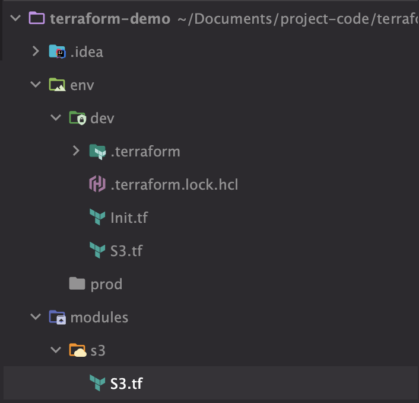

# 개념
* 중복되는 코드를 모듈을 사용해서 줄임
* 리소스를 모듈로 만들어서 원할때 모듈을 불러서 사용

# 디렉토리 구조

* 크게 modules, env로 디렉토리를 나눔
* modules에는 원하는 리소스를 정의해놓음
* env에서 원하는 인프라 환경을 디렉토리로 분리하고 환경에 따라 원하는 리소스를 생성하기 위해 modules에서 불러옴

# modules
## modules/s3/S3.tf
```plain text
# modules/s3/S3.tf

resource "aws_s3_bucket" "s3-terraform-bucket" {
  bucket = var.project_md_name

  lifecycle {
    prevent_destroy = true
  }

  tags = {
    Name    = "${var.project_md_name}-s3-terraform"
    Project = var.project_md_name
    Env     = var.env
  }
}

variable "project_md_name" {
  description = "프로젝트이름"
  type        = string
}

variable "env" {
  description = "환경"
  type        = string
}

```
* 모듈에서 사용된 변수는 모듈을 불러와 사용하는 곳에서 값을 주입한다.
* 가령 S3.tf 에서 

# env/dev
## S3.tf
```plain text
# env/dev/S3.tf

module "s3" {
  source          = "../../modules/s3"
  project_md_name = var.project_name
  env             = "dev"
}

variable "project_name" {
  description = "프로젝트이름"
  type        = string
  default     = "demo"
}
```
* module "s3" { … }
* source
* project_md_name
* env

## Init.tf
```plain text
# Init.tf

/*
[terraform version]
*/
terraform {
  required_version = "1.3.9"

  required_providers {
    aws = ">= 4.57.0"
  }
}

/*
[provider]
*/
provider "aws" {
  profile    = "demo"
  region     = "ap-northeast-2"
  access_key = "your key"
  secret_key = "your key"
}

/*
[AZ]
*/
data "aws_availability_zones" "available" {
  state = "available"
}
```
* 기본적 테라폼 설정(필수)
* 이제 dev환경에 S3를 생성할 준비는 완료되었다. env/dev 디렉토리 위치에서 “terraform plan” 명령어를 실행하면 된다.

# 참고자료
1. https://dev.classmethod.jp/articles/build-multiple-services-with-terraform-08/
