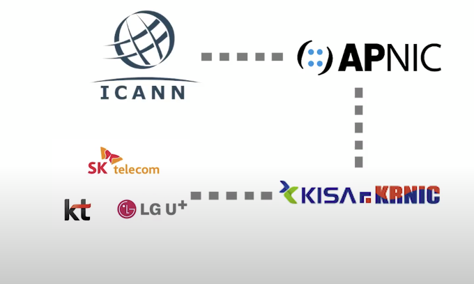

# IP 개념

* IP는 네트워크 가능한 장치들이 서로를 인식하고 통신하기 위한 식별자(고유 번호)
* 우리가 가정이나 회사에서 사용하고 있는 IP는 ISP(인터넷 서비스 제공자)에게 할당을 받는다.(SKT, KT, LG가 대표적인 ISP)
* ISP도 IP를 할당받아 판매하기 위해 국가(KRNIC)에 요청해서 할당받는다.
* 국가는 ICANN(국제인터넷주소관리기구)에서 국가별로 사용할 IP대역을 할당, 관리를 한다.
* 즉, 전세계에 사용되는 IP는 ICANN에서 관리하고 국가별로 IP를 할당해주며, 국가는 해당 국가의 ISP에게 IP를 할당해준다. ISP는 개인, 회사, 단체 등으로 IP를 할당해준다.
* 여기서 정확하게 말하면 ICANN가 직접 국가별로 관리하지 않는다.
* ICANN는 전세계를 대륙별로 나눠서 관리하기 위해 대륙별 인터넷등록기관을 나눴다. 우리나라는 APNIC기관에 속한다.
* 즉, 우리나라는 APNIC기관과 연락하여 IP를 할당, 관리 받는다.
* IP는 전세계 사람들이 사용하는 유한한 자원이다.
* IP종류는 IPv4, IPv6가 있다. 현재 IPv6는 IPv4의 고갈상태를 대비해서 만들어졌다.

# Reference
1. https://www.youtube.com/watch?v=W0x88b_dYhw
1. https://www.youtube.com/watch?v=IAS3U5ZiI8c

