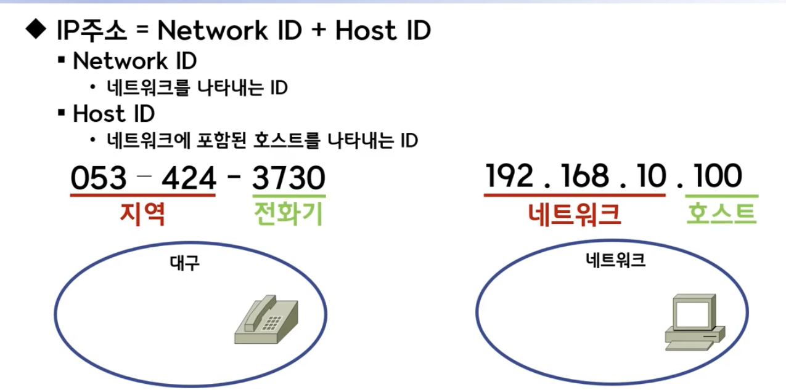

# IPv4의 표현
* IPv4는 대표적으로 2진수와 10진수로 표현한다.
* 일반적으로 개인PC에서 IP를 찾아보면 10진수로 표현되어 출력된다.
* 아직까지 IPv4를 사용하는 곳이 대부분이지만 이제 IPv4가 고갈되었다고 한다. 점차 IPv6로 대체될듯하다.

# IPv4 구분

* IP주소가 192.168.60.11(10진수로 표현)이면, “.”기준으로 나눠서 “옥텟”라고 말한다. 192를 하나의 옥텟, 168을 하나의 옥텟으로 구분할 수 있다.
* IPv4는 총 32bit로 구성되어있고 대략 43억개 IP를 할당할 수 있다.
* IP 192.168.60.11는 각각 “.”(하나의 옥텟)기준으로 2의 8제곱으로 8비트가 된다. 총 4개의 옥텟이 있어 32비트가 된다.
* “.”(옥텟)기준으로 2의 8제곱이니깐 10진수로 따지면 하나의 옥텟은 0~255범위를 가진다.
* IP주소는 크게 2가지로 나뉜다. 192.168.60은 네트워크ID, 11은 HostID로 나뉜다. 나누는 구분은 아래 IP class에 따라 달라진다.

# IPv4 Class 개념 및 종류
* IP를 보다 효율적으로 관리하기위해 IP를 Class로 나눈다.
* class를 나누는 기준은 네트워크 크기에 따른다. 구첵적으로 하나의 네트워크에서 몇개의 Host를 가질 수 있는가에 기준이 된다.
* 또한, class는 하나의 IP주소에서 네트워크 영역과 호스트 영역을 구분하는 기준이 된다. 우선 class의 종류는 아래와 같다.

1. A class: 대규모 네트워크 지원하기 위한 주소 범위
1. B class: 중대모 네트워크 지원하기 위한 주소 범위
1. C class: 소규모 네트워크 지원하기 위한 주소 범위
1. D class: 멀티캐스트용 주소 범위
1. E class: 연구용 주소 범위
1. D, E class는 PC에 사용하지 못한다.

## A class
* 하나의 네트워크가 가질 수 있는 호스트 수가 제일 많은 class다.
* 여기서 호스트는 단순하게 IP를 할당받을 수 있는 컴퓨터라고 생각하자.
* IP를 2진수로 표현했을때, 맨 앞자리 수가 항상 0인 경우가 바로 A class다.
* A class의 첫번째 옥텟은 네트워크 부분을 나타내고 나머지 부분을 호스트 부분이다.
* A class는 10진수로 0.0.0.0 ~ 127.255.255.255까지 범위를 가진다.
* 예를들어 A class인 IP주소 13.0.0.0을 할당받았다면, 13은 네트워크로 구분되고 나머지 0.0.0은 호스트로 구분한다.
* A class의 호스트IP는 총 24개의 2진수로 표현이 가능하다. 즉, 2^24(제곱근)개의 호스트IP를 가진다.
* 13.0.0.0 IP를 할당받으면, 13.0.0.0 ~ 13.255.255.255를 사용할 수 있다. 다만, 13.0.0.0은 네트워크 주소를 표현하기 위해서 호스트IP로 사용하면 안되며, 13.255.255.255는 브로드캐스트 주소로 사용하기 때문에 호스트IP로 사용하면 안된다. 따라서 호스트IP는 (2^24) - 2개수가 된다.

## B class
* 2진수로 표현하면 10xx xxxx. xxxx xxxx. xxxx xxxx. xxxx xxxx로 시작한다.
* 10진수로 표현하면 128.0.0.0 ~ 191.255.255.255까지다.
* 호스트 주소 범위는 (2^16) - 2개를 가진다.

## C class
* 2진수로 표현하면 110x xxxx. xxxx xxxx. xxxx xxxx. xxxx xxxx이다.
* 10진수로 표현하면 192.0.0.0 ~ 223.255.255.255범위를 가진다.
* 호스트 주소 범위는 (2^8) - 2개를 가진다.

# Reference
1. https://www.youtube.com/watch?v=gOMljj6K2V0
1. https://www.youtube.com/watch?v=b7Wk-6w5vgg
1. https://limkydev.tistory.com/168
1. https://limkydev.tistory.com/167

