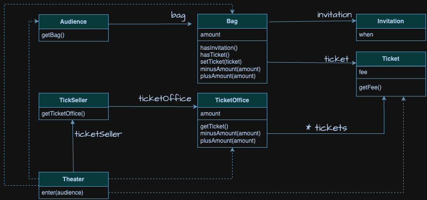

# 모듈이 가져야 하는 세 가지 기능
```plain text
모든 소트프웨 모듈에는 세 가지 목적이 있다. 첫 번째 목적은 실행 중에 제대로 동작하는 것이다.
이것은 모듈의 존재 이유라고 할 수 있다. 두 번째 목적은 변경을 위해 존재하는 것이다.
대부분의 모듈은 생명주기 동안 변경되기 때문에 간단한 작업만으로도 변경이 가능해야 한다.
변경하기 어려운 모듈은 제대로 동작하더라도 개선해야 한다. 모듈의 세 번째 목적은 코드를 읽는 사람과
의사소통하는 것이다. 모듈은 특별한 훈련 없이도 개발자가 쉽게 읽고 이해할 수 있어야한다.
읽는 사람과 의사소통할 수 없는 모듈은 개선해야 한다. -로버트 마틴<클린 소프트웨어>-
```
* 모든 모듈은 제대로 실행되어야 한다. (여기서 모듈이란 크기와 상관 없이 클래스나 패키지, 라이브러리와 같이 프로그램을 구성하는 임의의 요소를 의미)
* 변경이 용이해야 한다.
* 이해하기 쉬워야 한다.

# 문제점
## 예상을 빗나가는 코드
```java
// 극장
public class Theater {
	private TicketSeller ticketSeller;

	public Theater(TicketSeller ticketSeller) {
		this.tickeSeller = ticketSeller;
	}

	public void enter(Audience audience) {
		if(audience.getBag().hasInvitation()) {
			Ticket ticket = ticketSeller.getTicketOffice().getTicket();
			audience.getBag().setTicket(ticket);
		}else{
			Ticket ticket = ticketSeller.getTicketOffice().getTicket();
			audience.getBag().minusAount(ticket.getFee());
			ticketSeller.getTicketOffice().plusAmount(ticket.getFee());
			audience.getBag().setTicket(ticket);
		}
	}
}
```
* Theater(극장)클래스의 enter메서드가 수행하는 일을 풀어보면
* 소극장은 관람객의 가방을 열어 그 안에 초대장이 들어 있는지 살펴본다. 가방 안에 초대장이 들어 있으면 판매원은 매표소에 보관돼 있는 티켓을 관람객의 가방 안으로 옮긴다. 가방 안에 초대장이 들어 있지 않는다면 관람객의 가방에서 티켓 금액만큼의 현금을 꺼내 매표소에 적립한 후에 매표소에 보관돼 있는 티켓을 관람객의 가방 안으로 옮긴다.
* 관람객의 입장에서 문제는 극장이라는 제3자가 초대장을 확인하기 위해 관람객의 가방을 마음대로 열어본다.
* 판매원 입장에서는 극장이 허락도 없이 매표소에 보관 중인 티켓과 현금에 마음대로 접근할 수 있다.
* 더 큰 문제는 티켓을 꺼내 관란객의 가방에 집어넣고 관람객에게 받은 돈을 매표소에 적립하는 일을 극장이 수행한다.
* 이해 가능한 코드란 그 동작이 우리의 예상에서 크게 벗어나지 않는 코드다.
* 현실에서는 관람객이 직접 자신의 가방에서 초대장을 꺼내 판매원에게 건내며, 티켓을 구매하는 관람객은 가방 안에서 돈을 직접 꺼내 판매원에게 지불한다.
* 판매원은 매표소에 있는 티켓을 직접 꺼내 관람객에게 건네고 관람객에게서 직접 돈을 받아 매표소에 보관한다.
* 하지만 코드 안에 관람객, 판매원은 그렇게 하지 않는다. 현재의 코드는 우리의 상식과는 너무나도 다르게 동작하기 때문에 코드를 읽는 사람과 제대로 의사소통하지 못한다.
* 또한, enter메소드에는 Audience가 Bag을 가지고 있고, Bag안에는 현금과 티켓이 들어 있으며 TicketSeller가 TicketOffice에서 티켓을 판매하고, TicketOffice안에 돈과 티켓이 보관돼 있다는 모든 사실을 동시에 기억하고 있어야 한다.
* 메서드에서 너무 많은 세부사항을 다루기 때문에 코드를 작성하는 사람뿐만 아니라 코드를 읽고 이해해야 하는 사람 모두에게 큰 부담을 준다.

## 변경에 취약한 코드

* 가장 큰 문제는 변경에 취약하다는 것이다.
* 관람객이 가방을 들고 있지 않다면 어떻게 해야 할까?
* 관람객이 현금이 아니라 신용카드를 이용해서 결제한다면 어떻게 해야 할까?
* 판매원이 매표소 밖에서 티켓을 판매해야 한다면 어떻게 해야 할까?
* 이런 가정이 깨지는 순간 모든 코드가 일시에 흔들리게 된다.
* 관람객이 가방을 들고 있다는 가정이 바뀌었다고 상상해보자. Audience 클래스에서 Bag을 제거해야 할 뿐만 아니라 Audience의 Bag에 직접 접근하는 Theater의 enter 메서드 역시 수정해야 한다.
* 다른 클래스가 Audience의 내부에 대해 더 많이 알면 알수록 Audience를 변경하기 어려워진다.
* 이것은 객체 사이의 의존성과 관련된 문제다.
* 의존성이라는 말 속에는 어떤 객체가 변경될 때 그 객체에게 의존하는 다른 객체도 함께 변경될 수 있다는 사실이 내포돼 있다.
* 그렇다고 해서 객체 사이의 의존성을 완전히 없애는 것이 정답은 아니다.
* 객체지향 설계는 서로 의존하면서 협력하는 객체들의 공동체를 구축하는 것이다.
* 목표는 애플리케이션의 기능을 구현하는 데 필요한 최소한의 의존성만 유지하고 불필요한 의존성을  제거하는 것이다.
* 객체 사이의 의존성이 과한 경우를 가리켜 결합도가 높다고 말한다. 반대로 객체들이 합리적인 수준으로 의존할 경우 결합도가 낮다고 말한다.
* 두 객체 사이의 결합도가 높으면 높을수록 함께 변경될 확률도 높아지기 때문에 변경하기 어려워진다. 설계의 목표는 객체 사이의 결합도를 낮춰 변경이 용이한 설계를 만드는 것이어야 한다.

