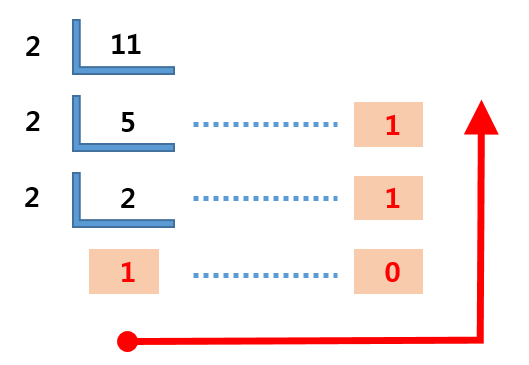

# 2진법을 10진법으로
2진법에서 각 자리값은 2의 제곱으로 나타냄 1011에서 맨 왼쪽 숫자부터 자리값을 나타내면 
넷째 자리 1의 자리값은 2의 3제곱: 8 셋째 자리 0의 자리값은 2의 2제곱: 4 둘째 자리 1의 자리값은 2의 1제곱: 2 첫째 자리의 1의 자리값은 2의 0제곱: 1 
2진법은 각자리의 제곱 * 각자리의 숫자를 계산하면 10진법으로 변환된다. 1011 = 1 * 2(3) + 0 * 2(2) + 1 * 2(1) + 1 * 2(0) = 8 + 0 + 2 + 1 = 11 
# 10진법을 2진법으로

* 10진수 값을 소인수분해

# Reference
1. https://meaningone.tistory.com/606

